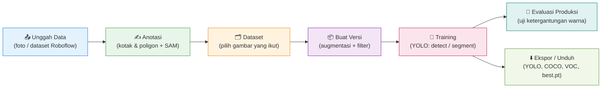
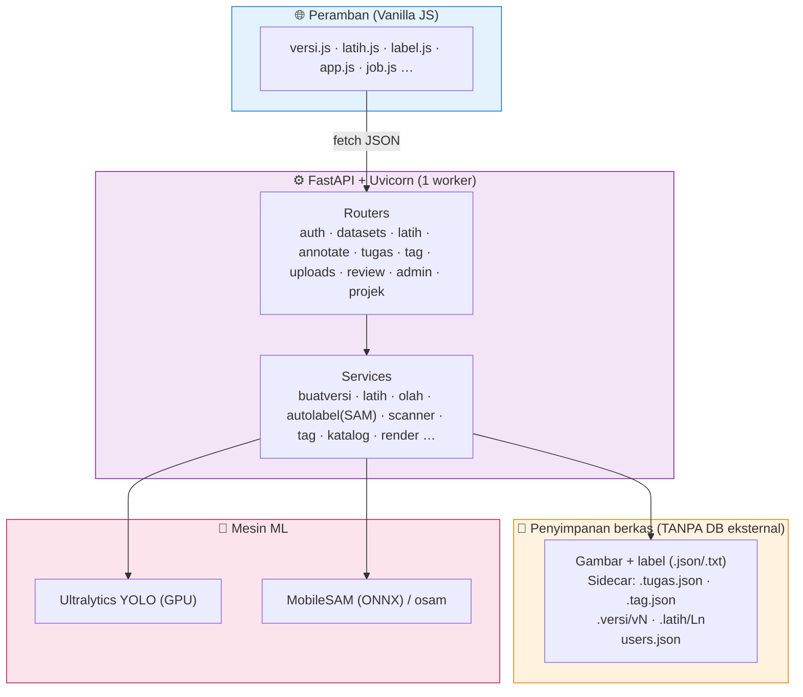

# 🏷️ HIGOLAB

### Alat Pelabelan, Versioning Dataset, & Training Model — untuk Mesin Sortir Sampah (RVM)

*Dari foto mentah → anotasi → dataset siap latih → model YOLO → evaluasi produksi, dalam satu aplikasi web.*

`FastAPI` · `Ultralytics YOLO` · `SAM` · `Vanilla JS` — tanpa database eksternal

---

## 📌 1. Apa itu HIGOLAB?

**HIGOLAB** adalah aplikasi web (fork dari AnyLabeling) yang menyatukan **seluruh siklus hidup dataset computer vision** dalam satu tempat: mengunggah foto, melabeli objek (kotak & poligon segmentasi), menyusunnya menjadi versi dataset yang teraugmentasi, melatih model YOLO, lalu mengevaluasinya di kondisi produksi.

Dibangun khusus untuk kebutuhan **Reverse Vending Machine (RVM) / mesin sortir sampah**: mendeteksi & memilah kemasan (botol, kaleng, tetra, plastic-cup, mlp, dll.) di ruang detektor dengan pencahayaan nyata.

> **Filosofi:** satu orang bisa berjalan dari **foto mentah sampai model terlatih** tanpa berpindah alat, tanpa menulis kode, tanpa database terpisah.

---

## 🗺️ 2. Peta Sistem (Alur Besar)

---

## ✨ 3. Fitur Utama

### 📤 Unggah & Impor Data
| Fitur | Penjelasan |
|---|---|
| Unggah foto / batch | Banyak berkas sekaligus; tiap unggahan diberi nama **batch** otomatis (bisa diganti). |
| Impor dataset Roboflow / YOLO / labelme | Split train/valid/test **diratakan** otomatis (tidak dipertahankan). |
| Paginasi & lazy-load | Grid 11rb+ gambar tetap ringan (paginasi server-side). |

### ✍️ Anotasi (Kanvas Pelabelan)
| Fitur | Penjelasan |
|---|---|
| Kotak & Poligon segmentasi | Dukungan deteksi **dan** segmentasi. |
| **SAM (Segment Anything)** | Klik objek → poligon otomatis. MobileSAM (ONNX, GPU cepat ~40ms) + model osam (sam2:tiny/small, dll.). |
| **+Point / −Point** | Menuntun SAM: klik tambah/kurang area. |
| Menggambar sentuh (touch) | Mendukung jari (draw) & pinch-zoom di layar sentuh. |
| Tandai **latar** (negatif) | Gambar tanpa objek sebagai contoh negatif yang disengaja. |
| Navigasi ikut filter | Panah kiri/kanan mengikuti tab penugasan (mis. "belum dianotasi"). |

### 🗂️ Dataset & Penugasan
| Fitur | Penjelasan |
|---|---|
| Masukkan ke Dataset | Hanya gambar **beranotasi atau latar** yang boleh masuk. |
| Penugasan pelabel | Bagikan jatah gambar ke beberapa pelabel; tiap orang melabeli jatahnya. |
| Tag & batch | Kelompokkan/tandai gambar untuk penyaringan. |

### 📦 Pembuatan Versi (Version Builder)
| Fitur | Penjelasan |
|---|---|
| Wizard 6 langkah | Sumber → Kelas → Split → Preprocessing → Augmentasi → Buat. |
| **Langkah "Kelas" (Modify Classes)** | Pakai / jadikan **latar** / **gabung** / **ganti nama** kelas — tanpa mengubah dataset sumber. |
| **Mode Warna** | **BENTUK** (warna diacak → model belajar bentuk) vs **WARNA** (warna dijaga → jadi identitas kelas). Lihat [Kamus Parameter](04-Kamus-Parameter.md). |
| **Filter sumber** | Buang foto per **batch/tag**, atau **buang foto katalog** otomatis (deteksi latar putih), **tanpa** mengubah dataset. Peringatan bila membuang >40%. |
| Estimasi sebelum build | Perkiraan jumlah gambar, objek, ukuran, & sisa disk — sebelum menulis apa pun. |
| Augmentasi dimaterialisasi | Versi ditulis ke `.versi/vN/` (sumber tak pernah disentuh). |

### 🎯 Training
| Fitur | Penjelasan |
|---|---|
| Latih YOLO dari sebuah versi | Detect / Segment; parameter preset v14 (bisa diubah di setelan lanjutan). |
| Setelan warna disinkronkan | Hyperparameter HSV latih dipaksa **sejalan** dengan mode augmentasi versinya (mencegah *color shortcut*). |
| Kemajuan real-time | Kurva per epoch, ETA, persen dalam-epoch, pemakaian GPU/RAM. |
| **Training lanjutan** | Lanjutkan dari `best.pt`/`last.pt` training sebelumnya, mewarisi setelan. |
| Rincian model | mAP per kelas, galeri hasil (kaca pembesar), **daftar kelas** yang dikenal model. |
| Unduh bobot | `best.pt` / `last.pt`, termasuk yang sementara selagi training berjalan. |

### 🔬 Evaluasi Produksi
| Fitur | Penjelasan |
|---|---|
| Uji ketergantungan warna | Apakah keputusan model berubah saat warna digeser (grayscale, hue±, saturasi×, iluminan)? |
| Uji kelas default & latar | Apakah model salah mendeteksi pada latar kosong? |
| Akurasi + confusion | Benar/salah + tertukar ke kelas apa. |

### ⬇️ Ekspor
YOLO (box/seg), COCO, VOC, CreateML, ZIP.

---

## 🏗️ 4. Arsitektur Teknis

**Poin arsitektur penting:**
- **Tanpa database eksternal.** Seluruh "database" adalah **berkas pendamping (sidecar JSON)** di sebelah gambar + `users.json`. Portabel: pindahkan folder = pindahkan data. (Detail di [Instalasi & Migrasi](03-Instalasi-dan-Migrasi.md).)
- **Dua venv:** CPU (`.venv`) untuk jalan biasa; GPU (`.venv-gpu`, torch + ultralytics) untuk training/olah berat. Dikendalikan `LABELAPP_OLAH=gpu`.
- **Dev & Prod terpisah:** dev (port 8043, auto-reload) untuk uji coba; prod (port 8042) untuk pemakaian nyata.

---

## 👥 5. Peran Pengguna (ringkas)

| Peran | Bisa apa |
|---|---|
| 🔑 **Admin** | Kelola pengguna, setujui pendaftaran. |
| 👤 **Pemilik projek** | Lihat, labeli apa pun, kelola versi/training, tugaskan pelabel, undang anggota. |
| 🖊️ **Pelabel bertugas** | Lihat semua, melabeli **hanya jatahnya**. |
| 👁️ **Anggota** | Lihat semua, **tidak** boleh melabeli. |
| 🚫 **Bukan anggota** | Projek tidak muncul. |

> Detail hak akses & diagram use-case lengkap ada di [Diagram UML](05-Diagram-UML.md).

---

## 📚 Dokumen Terkait
1. **Tentang HIGOLAB** — dokumen ini
2. [Kebutuhan Sistem](02-Kebutuhan-Sistem.md) — perangkat, env, library
3. [Instalasi & Migrasi](03-Instalasi-dan-Migrasi.md) — pindah ke PC lain, database, jaringan
4. [Kamus Parameter](04-Kamus-Parameter.md) — arti hsv, learning rate, dll.
5. [Diagram UML](05-Diagram-UML.md) — flowchart & use-case lengkap
