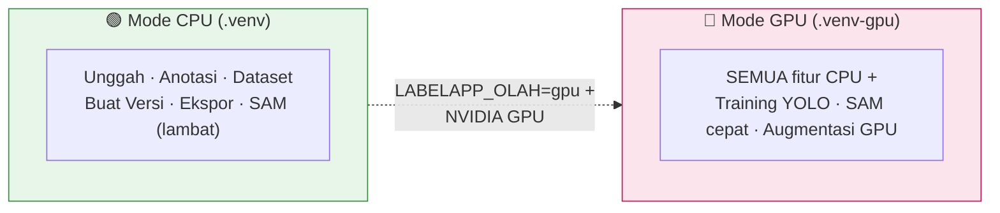

# 🧰 Kebutuhan Sistem HIGOLAB

*Apa yang dibutuhkan untuk menjalankan / memindahkan HIGOLAB ke perangkat lain.*

---

## 🎚️ Ringkasan: Dua Tingkat Kebutuhan

HIGOLAB bisa jalan di **dua mode**, tergantung apakah kamu perlu **melatih model** atau cukup **melabeli**:

> **Aturan sederhana:** Melabeli & membuat versi → cukup **CPU**. Melatih model → **wajib NVIDIA GPU**.

---

## 💻 1. Perangkat Keras (Hardware)

| Komponen | Minimum (labeling saja) | Rekomendasi (labeling + training) |
|---|---|---|
| **CPU** | 4 core | 8+ core (dataset besar & augmentasi paralel) |
| **RAM** | 8 GB | 32 GB (baseline mesin uji: 31 GB) |
| **GPU** | — (tidak wajib) | **NVIDIA, VRAM ≥ 8 GB** (baseline: RTX 3060 Ti 8 GB). SAM3/model besar butuh lebih. |
| **Disk** | 20 GB + ukuran dataset | **SSD/NVMe** (dataset 11rb+ gambar + versi teraugmentasi bisa puluhan GB) |
| **Layar sentuh** | opsional | opsional (didukung untuk anotasi jari) |

> ⚠️ **Catatan VRAM:** Training + SAM GPU berbagi VRAM. Di 8 GB, jalankan training **atau** SAM besar bergantian — bukan bersamaan (ada penjaga memori otomatis, tapi VRAM tetap terbatas).

**Baseline terukur:** ~91 gambar/detik training di RTX 3060 Ti. Dataset 1 juta gambar / 7 hari butuh sekitar **6,7× kapasitas ini** (GPU + CPU + RAM + NVMe seimbang).

---

## 🖥️ 2. Sistem Operasi & Runtime

| Kebutuhan | Versi | Catatan |
|---|---|---|
| **OS** | Linux (Ubuntu 22.04+ / kernel 6.x) | Dikembangkan di Linux 6.8. Skrip `start.sh`/`deploy.sh` berbasis bash. |
| **Python** | **3.13.x** (diuji 3.13.9) | Wajib. |
| **CUDA / Driver NVIDIA** | Sesuai `torch` (build cu13x) | Hanya untuk mode GPU. Cek `nvidia-smi`. |
| **Node.js** | — | **Tidak wajib** untuk menjalankan (JS-nya vanilla, disajikan statis). Hanya alat pengembangan. |

---

## 📦 3. Library (Dependensi Python)

### 🟢 Inti — `requirements.txt` (mode CPU, wajib)
| Library | Versi | Fungsi |
|---|---|---|
| `fastapi` | 0.141.1 | Kerangka web (API + halaman) |
| `uvicorn[standard]` | 0.52.1 | Server ASGI |
| `Jinja2` | 3.1.6 | Template HTML |
| `python-multipart` | 0.0.32 | Unggah berkas |
| `opencv-python` | 5.0.0.93 | Pemrosesan gambar |
| `numpy` | 2.5.2 | Komputasi numerik |
| `Pillow` | 12.3.0 | Baca/tulis gambar |
| `PyYAML` | 6.0.3 | Baca `data.yaml` |
| `onnxruntime` | 1.28.0 | Menjalankan MobileSAM (ONNX) |
| `osam` | 0.5.0 | Model SAM tambahan (sam2, efficientsam, dll.) |
| `albumentations` | 2.0.8 | Augmentasi gambar |
| `shapely` | 2.1.2 | Geometri poligon |
| `psutil` | — | Statistik CPU/RAM |

### 🔴 Tambahan GPU — `requirements-gpu.txt` (mode training)
| Library | Fungsi |
|---|---|
| `torch`, `torchvision` | Deep learning (bangun cu13x sesuai CUDA) |
| `onnxruntime-gpu` | MobileSAM di GPU (cepat) |
| `ultralytics` | Training YOLO |

### 🧪 Pengembangan — `requirements-dev.txt`
`pytest` + alat uji (opsional, hanya untuk menjalankan test suite).

> 💡 **Kenapa dua venv?** `ultralytics` sengaja **tidak** dipasang di venv CPU. Server yang jalan mode CPU tetap bisa melabeli & membuat versi, dan menolak training dengan pesan jelas ("perlu `LABELAPP_OLAH=gpu`") alih-alih gagal misterius.

---

## 🔧 4. Variabel Lingkungan (Environment Variables)

Semua berawalan `LABELAPP_`:

| Variabel | Contoh | Fungsi |
|---|---|---|
| `LABELAPP_OLAH` | `gpu` / `cpu` | **Kunci utama**: aktifkan jalur GPU (training, olah berat). |
| `LABELAPP_DATASETS_ROOT` | `./dev-data/datasets` | Folder dataset bersama. |
| `LABELAPP_UPLOADS_ROOT` | `./dev-data/unggahan` | Folder unggahan per-akun (projek pengguna). |
| `LABELAPP_USERS_FILE` | `users.json` | Berkas akun & peran. |
| `LABELAPP_HOST` | `0.0.0.0` / `127.0.0.1` | Alamat bind. |
| `LABELAPP_PORT` | `8042` (prod) / `8043` (dev) | Port. |
| `LABELAPP_OSAM_GPU` | `1` | Izinkan model osam besar di GPU. |
| `LABELAPP_SAM_DIR` / `LABELAPP_BOBOT_DIR` | path | Lokasi berkas model SAM / bobot `.pt`. |
| `LABELAPP_MAX_UPLOAD_MB` | `50` | Batas ukuran unggah. |
| `LABELAPP_UTAS` / `LABELAPP_VERSI_SERENTAK` | angka | Batas paralelisme olah / build versi. |

> Skrip `start.sh` membaca env ini; jalankan mis. `LABELAPP_OLAH=gpu ./start.sh prod`.

---

## 🌐 5. Jaringan (ringkas)

| Hal | Nilai |
|---|---|
| Port default prod | **8042** |
| Port default dev | **8043** |
| Firewall | Dibatasi ke IP tertentu via `ufw` (mis. hanya IP kantor boleh akses 8042). |
| Reverse proxy | Opsional (Nginx) untuk domain/HTTPS. |

> Detail konfigurasi jaringan & firewall ada di [Instalasi & Migrasi](03-Instalasi-dan-Migrasi.md#-6-jaringan--firewall).

---

## ✅ Checklist Cepat Pindah Perangkat
- [ ] Linux + Python 3.13
- [ ] (Opsional training) NVIDIA GPU + driver CUDA, cek `nvidia-smi`
- [ ] Buat `.venv` (CPU) → `pip install -r requirements.txt`
- [ ] (Opsional) Buat `.venv-gpu` → `pip install -r requirements.txt -r requirements-gpu.txt`
- [ ] Siapkan folder dataset & unggahan + `users.json`
- [ ] Set variabel `LABELAPP_*`
- [ ] Buka port di firewall
- [ ] Jalankan `./start.sh prod`

➡️ **Langkah demi langkah lengkap:** [Instalasi & Migrasi](03-Instalasi-dan-Migrasi.md).
