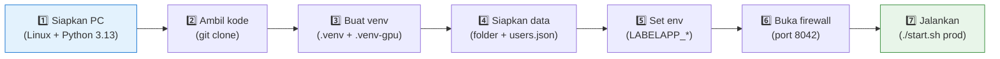
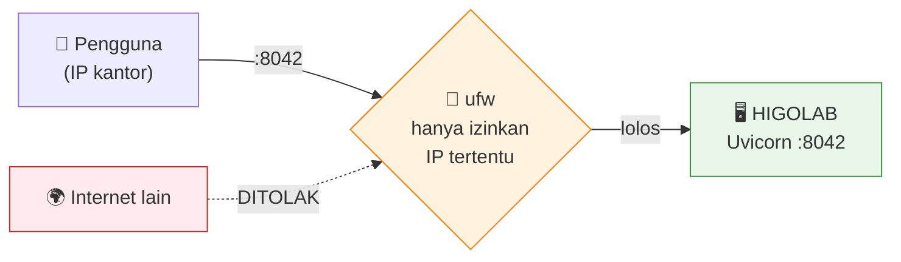
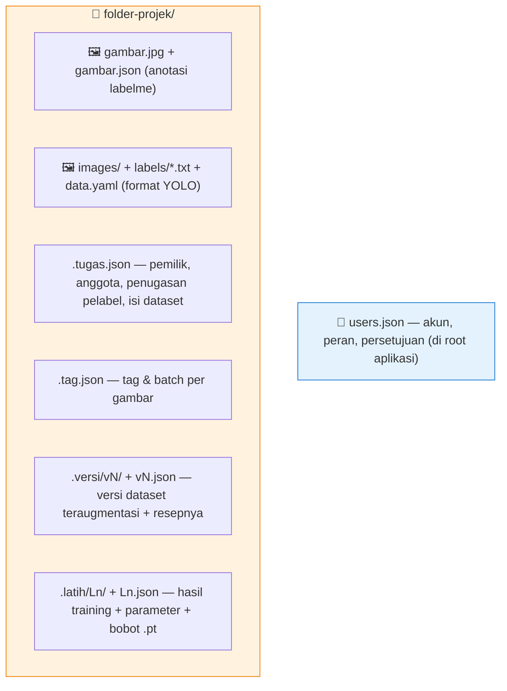

<div align="center">

# 🚚 Instalasi & Migrasi HIGOLAB

*Cara memindahkan, memasang, dan menjalankan HIGOLAB di PC lain — termasuk "database" & jaringan.*

</div>

---

## 🧭 Peta Proses



---

## 1️⃣ Prasyarat PC Tujuan
- **Linux** (Ubuntu 22.04+), akses `sudo` untuk firewall.
- **Python 3.13** + `python3-venv`.
- (Training) **NVIDIA GPU** + driver CUDA — verifikasi: `nvidia-smi`.
- **Git**.

---

## 2️⃣ Ambil Kode (Clone)

```bash
cd ~/tempat-projek
git clone https://github.com/adityadarmawann/labeling-tools.git
cd labeling-tools/label-apps
```

> Struktur: repo induk `labeling-tools/`, aplikasi ada di subfolder **`label-apps/`** (semua perintah di bawah dijalankan dari `label-apps/`).

---

## 3️⃣ Buat Virtualenv & Pasang Library

**venv CPU (wajib):**
```bash
python3 -m venv .venv
.venv/bin/python -m pip install -r requirements.txt
```

**venv GPU (untuk training):**
```bash
python3 -m venv .venv-gpu
.venv-gpu/bin/python -m pip install -r requirements.txt -r requirements-gpu.txt
# pasang torch sesuai CUDA PC-mu (mis. cu130) bila perlu index khusus
```

> ⚠️ **Penting:** pasang paket lewat `.venv/bin/python -m pip …` (bukan `.venv/bin/pip`) agar tidak salah venv.

---

## 4️⃣ Siapkan Data & Akun

### a. Folder data
```bash
mkdir -p data/datasets      # dataset bersama
mkdir -p data/unggahan      # projek per-akun
```

### b. Buat akun pertama (jadi Admin otomatis)
```bash
.venv/bin/python run.py --users users.json --adduser namamu
# pengguna PERTAMA otomatis diangkat jadi ADMIN
```

> Tambah pengguna lain dengan perintah yang sama; kelola peran/persetujuan lewat halaman **/akun** setelah masuk.

---

## 5️⃣ Konfigurasi Environment

Buat berkas env (atau ekspor langsung). Contoh **prod**:

```bash
export LABELAPP_OLAH=gpu                 # 'cpu' bila tanpa GPU
export LABELAPP_DATASETS_ROOT=./data/datasets
export LABELAPP_UPLOADS_ROOT=./data/unggahan
export LABELAPP_USERS_FILE=users.json
export LABELAPP_HOST=0.0.0.0             # 127.0.0.1 = hanya lokal
export LABELAPP_PORT=8042
```

> Daftar lengkap variabel: lihat [Kebutuhan Sistem §4](02-Kebutuhan-Sistem.md#-4-variabel-lingkungan-environment-variables).

---

## 6️⃣ 🌐 Jaringan & Firewall



**Buka port hanya untuk IP tepercaya (contoh):**
```bash
sudo ufw allow from <IP-KANTOR> to any port 8042 proto tcp
sudo ufw status | grep 8042
```

> 🔒 **Praktik aman:** jangan buka 8042 ke seluruh internet. Batasi ke IP tepercaya. Untuk domain + HTTPS, taruh **Nginx (reverse proxy)** di depan dan sajikan TLS dari sana.
>
> ⚠️ Perintah `sudo`/`ufw` **dijalankan oleh operator manusia**, bukan otomatis.

---

## 7️⃣ Jalankan

```bash
./start.sh prod        # produksi (port 8042)
./start.sh dev         # pengembangan (port 8043, auto-reload)
# mode GPU:
LABELAPP_OLAH=gpu ./start.sh prod
```

`start.sh` otomatis: memilih venv sesuai `LABELAPP_OLAH`, memverifikasi library, mengecek `users.json` & folder data, lalu menyalakan Uvicorn. Buka `http://<ip-mesin>:8042`.

---

## 💾 8. "Database"-nya: Berkas Pendamping (Sidecar)

HIGOLAB **tidak memakai database eksternal** (tak ada Postgres/MySQL/Mongo). Seluruh keadaan disimpan sebagai **berkas di sebelah gambar** + `users.json`. Ini yang membuat migrasi = **menyalin folder**.



| Berkas | Isi |
|---|---|
| `<gambar>.json` / `labels/*.txt` | Anotasi (labelme JSON atau YOLO txt). |
| `.tugas.json` | Pemilik projek, anggota, penugasan pelabel, daftar isi dataset. |
| `.tag.json` | Tag & nama batch tiap gambar. |
| `.versi/vN/` + `vN.json` | Berkas versi teraugmentasi + resep (augmentasi, kelas, filter). |
| `.latih/Ln/` + `Ln.json` | Keluaran training (bobot `best.pt`/`last.pt`, kurva, metrik) + parameter. |
| `users.json` | Akun & peran (di folder aplikasi). |

### 🔁 Cara Migrasi Data (pindah PC)
```bash
# di PC LAMA — cadangkan data + akun
rsync -av data/  user@pc-baru:~/labeling-tools/label-apps/data/
rsync -av users.json user@pc-baru:~/labeling-tools/label-apps/
# (opsional) bobot model .pt sudah ikut di dalam data/.../.latih/
```

> ✅ Karena semua keadaan berupa berkas, **cukup salin folder `data/` + `users.json`** ke PC baru yang sudah dipasang (langkah 2–5). Tidak ada dump/restore database.
>
> 💾 **Backup** = jadwalkan `rsync`/snapshot folder `data/` + `users.json`. Itu saja sudah mencakup seluruh dataset, versi, model, dan akun.

---

## 🔀 9. Dev vs Prod & Alur Rilis (opsional)

Repo memakai **dua git worktree**: `dev` (uji coba, port 8043) dan `main`/prod (port 8042). Kode naik dari dev ke prod lewat:

```bash
./deploy.sh --dari-dev   # gabungkan cabang dev → main, lalu nyalakan ulang prod
```

> Untuk instalasi baru di satu PC, kamu **tidak wajib** memakai dua worktree — cukup satu clone + `./start.sh prod`. Skema dev/prod hanya untuk alur pengembangan berkelanjutan.

---

## 🩺 10. Verifikasi & Masalah Umum

| Gejala | Penyebab / Solusi |
|---|---|
| "Virtualenv belum ada" | Buat venv (langkah 3). |
| "Belum ada akun di users.json" | Buat akun (langkah 4b). |
| Training ditolak | Server mode CPU → jalankan `LABELAPP_OLAH=gpu ./start.sh prod` (butuh `.venv-gpu`). |
| Tak bisa diakses dari PC lain | `LABELAPP_HOST=0.0.0.0` + buka port di firewall (langkah 6). |
| Projek "hilang" | Jalankan lewat `./start.sh` (bukan uvicorn telanjang) agar env `LABELAPP_*` terbaca. |

---

➡️ Arti angka-angka parameter (hsv, learning rate, dll.): [Kamus Parameter](04-Kamus-Parameter.md).
➡️ Alur & hak akses lengkap: [Diagram UML](05-Diagram-UML.md).
