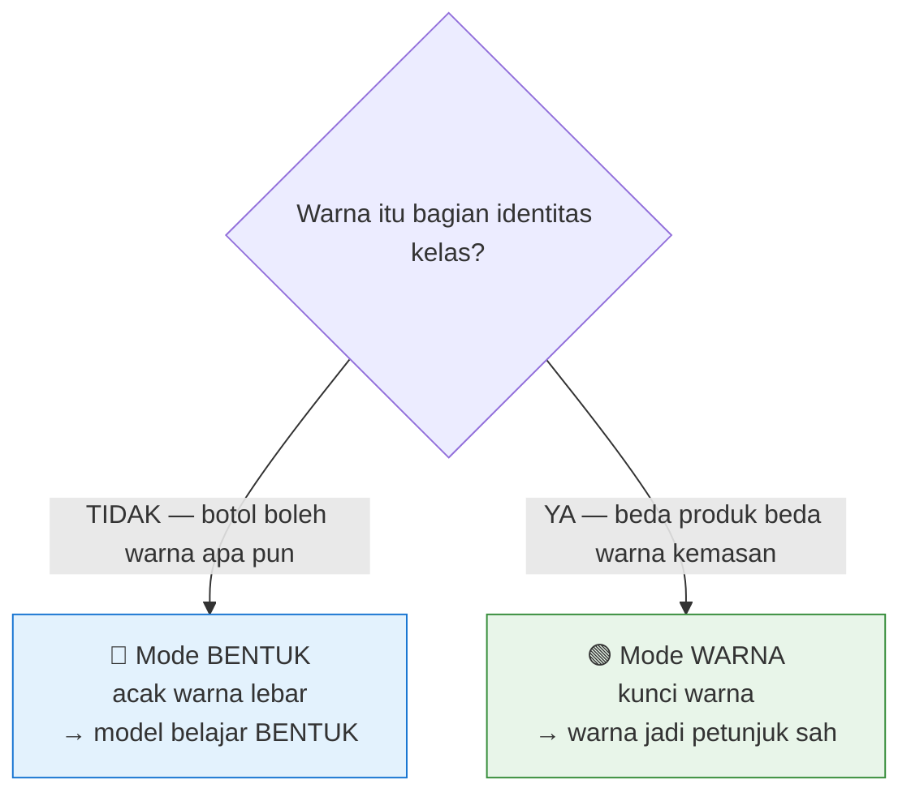

# 📖 Kamus Parameter HIGOLAB

*Arti setiap angka di Augmentasi & Training — dijelaskan dengan bahasa sederhana.*

Dipakai saat **Buat Versi** (augmentasi) dan **Training** (setelan lanjutan).

---

## 🧠 Cara Membaca Kamus Ini

Setiap parameter punya: **Arti** (bahasa manusia), **Rentang** (batas yang diizinkan), **Bawaan** (nilai default preset v14), dan **Kapan diubah**.

> 💡 **Aturan emas:** kalau ragu, **biarkan bawaannya**. Preset v14 sudah disetel dari pengalaman nyata. Ubah satu per satu, bukan sekaligus.

---

## 🎨 A. Warna & Pencahayaan (Augmentasi Fotometrik)

Ini yang **paling menentukan** apakah model belajar warna atau bentuk.

| Parameter | Arti sederhana | Rentang | Bawaan (BENTUK) | Mode WARNA |
|---|---|---|---|---|
| **`hsv_h`** (Hue) | Menggeser **rona/corak** warna (memutar roda warna: merah↔hijau↔biru). Besar = warna berubah total. | 0.0 – 0.5 | 0.03 | **0.0** (dikunci) |
| **`hsv_s`** (Saturation) | Mengubah **kepekatan** warna (pucat ↔ ngejreng). | 0.0 – 1.0 | 0.7 | **0.20** (ditekan) |
| **`hsv_v`** (Value) | Mengubah **kecerahan** (gelap ↔ terang) — meniru pencahayaan. | 0.0 – 1.0 | 0.5 | 0.50 (tetap lebar) |
| **`bgr`** | Peluang **menukar kanal merah↔biru** (membalik warna total). | 0.0 – 1.0 | 0.1 | **0.0** (mati) |

> **Kenapa penting?** Kalau dua produk cuma beda warna (mis. navy vs hitam), `hsv_s` besar akan **mengaburkan** bedanya → gunakan **Mode WARNA**. Kalau botol bisa warna apa pun, `hsv` besar **bagus** karena memaksa model belajar bentuk → **Mode BENTUK**.
>
> **Rumus HSV (Ultralytics):** Hue digeser **`±hsv_h × 180°`**; Saturation & Value **dikalikan** faktor acak `[1−gain, 1+gain]`.

---

## ⚙️ B. Inti Training (Optimizer & Jadwal)

| Parameter | Arti sederhana | Rentang | Bawaan | Kapan diubah |
|---|---|---|---|---|
| **`epochs`** | Berapa kali model membaca **seluruh** data latih. | 1 – 1000 | 250 | Naikkan bila model belum konvergen; turunkan bila cepat overfit. |
| **`imgsz`** | Ukuran gambar saat latih (piksel). Besar = objek kecil lebih terlihat, tapi berat. | 320 – 1280 | 640 | Naikkan (960/1280) untuk **objek kecil** — asal sumbernya juga resolusi tinggi. |
| **`batch`** | Berapa gambar diproses sekaligus. Besar = butuh VRAM lebih. | 1 – 64 | 16 | Turunkan bila **kehabisan VRAM (OOM)**. |
| **`lr0`** (learning rate awal) | **Seberapa besar langkah** model belajar tiap update. Terlalu besar = tak stabil; terlalu kecil = lambat. | 1e-6 – 0.1 | 0.0003 | Jarang diubah; kecil untuk fine-tune dari bobot pra-latih. |
| **`lrf`** (learning rate akhir) | Faktor pengecil lr di akhir (lr akhir = `lr0 × lrf`). | 0.0001 – 1.0 | 0.01 | Biarkan. |
| **`cos_lr`** | Menurunkan lr mengikuti kurva **kosinus** (halus). | on/off | true | Biarkan. |
| **`warmup_epochs`** | Epoch awal dengan lr dinaikkan pelan (pemanasan) agar stabil. | 0 – 20 | 3 | Biarkan. |
| **`patience`** | Berhenti dini bila **tak membaik** sekian epoch (early stopping). | 0 – 500 | 50 | Naikkan bila ingin latih lebih sabar. |
| **`optimizer`** | Algoritma pengoptimal (AdamW). | — | AdamW | Biarkan. |
| **`workers`** | Utas pemuat data. | 0 – 16 | 8 | Turunkan bila CPU/RAM terbatas. |
| **`seed`** | Angka acak awal (agar hasil bisa diulang). | — | 0 | Ubah untuk uji beberapa kali. |

---

## ⚖️ C. Bobot Loss (seberapa "dihukum" tiap kesalahan)

| Parameter | Arti sederhana | Rentang | Bawaan |
|---|---|---|---|
| **`box`** | Bobot ketepatan **kotak** (lokasi & ukuran). | 0 – 20 | 7.5 |
| **`cls`** | Bobot ketepatan **kelas** (jenis objek). | 0 – 20 | 2.0 |
| **`dfl`** | Bobot presisi tepi kotak (distribution focal loss). | 0 – 20 | 1.5 |

> Naikkan `cls` bila model sering **salah kelas**; naikkan `box` bila kotaknya **meleset**. Ubah hati-hati.

---

## 📐 D. Geometri (Augmentasi Bentuk/Posisi)

Ini jalur **belajar bentuk** — terpisah dari warna, jadi mengubahnya **tidak** merusak sinyal warna.

| Parameter | Arti sederhana | Rentang | Bawaan |
|---|---|---|---|
| **`scale`** | Perbesar/perkecil objek acak. | 0 – 1 | 0.3 |
| **`degrees`** | Putar gambar (± derajat). | 0 – 180 | 25 |
| **`translate`** | Geser gambar (fraksi). | 0 – 1 | 0.15 |
| **`fliplr`** | Peluang cermin **kiri↔kanan**. | 0 – 1 | 0.5 |
| **`flipud`** | Peluang cermin **atas↔bawah**. | 0 – 1 | 0.3 |
| **`shear`** | Miringkan (geser sudut). | — | 0.0 |
| **`perspective`** | Distorsi perspektif. | — | 0.0 |

---

## 🧩 E. Augmentasi Lanjut (Penggabung Gambar)

| Parameter | Arti sederhana | Rentang | Bawaan |
|---|---|---|---|
| **`mosaic`** | Tempel 4 gambar jadi 1 (bagus untuk **objek kecil** & variasi). | 0 – 1 | 0.3 |
| **`close_mosaic`** | Matikan mosaic di **N epoch terakhir** (agar rapi menjelang selesai). | 0 – 200 | 30 |
| **`copy_paste`** | Salin-tempel objek antar gambar (segmentasi). | 0 – 1 | 0.0 |
| **`mixup`** / **`cutmix`** | Campur dua gambar. | 0 – 1 | 0.0 |

---

## 🎭 F. Segmentasi & Teknis

| Parameter | Arti sederhana | Bawaan |
|---|---|---|
| **`overlap_mask`** | Izinkan mask objek saling tumpang. | true |
| **`mask_ratio`** | Rasio downsample mask (1–8). Kecil = presisi, berat. | 2 |
| **`rect`** | Latih dengan rasio persegi panjang (bukan kotak). | false |
| **`cache`** | Simpan gambar di RAM agar cepat (butuh RAM besar). | false |
| **`plots`** | Buat grafik hasil training. | true |

---

## 🔗 G. Kaitan Penting: Konsistensi Augmentasi ↔ Training

> ⚠️ **Ini kunci menghindari "color shortcut".** Setelan warna saat **Buat Versi** harus **sejalan** dengan hyperparameter HSV saat **Training**. HIGOLAB **memaksa** keduanya sinkron lewat Mode Warna — kombinasi tak sejalan menghasilkan model yang angkanya bagus tapi **gagal di produksi**.

| Mode | Versi (augmentasi dataset) | Training (hsv) |
|---|---|---|
| **BENTUK** | rona diacak lebar | `hsv_h=0.03, hsv_s=0.7, bgr=0.1` |
| **WARNA** | rona dikunci | `hsv_h=0.0, hsv_s=0.20, bgr=0.0` |

---

## 💡 Resep Cepat (Cheat Sheet)

| Situasi | Yang diubah |
|---|---|
| Objek **kecil** sering terlewat | `imgsz` ↑ (960/1280) + `mosaic` tetap + tambah data kecil |
| **Kehabisan VRAM (OOM)** | `batch` ↓ (8), atau `imgsz` ↓ |
| Model **salah kelas** | `cls` ↑, cek anotasi |
| Produk **beda hanya warna** | pakai **Mode WARNA** |
| Kemasan **warna bebas** (botol dll.) | pakai **Mode BENTUK** |
| Latih **lebih sabar** | `patience` ↑, `epochs` ↑ |

---

## 🖥️ Catatan: Akses dari Dalam Aplikasi

Idealnya kamus ini juga bisa dibuka **langsung dari HIGOLAB** — mis. tombol **"?"** di setelan lanjutan **Buat Versi** dan **Training**, menampilkan penjelasan tiap parameter saat di-hover/klik. Implementasi panel bantuan ini bisa ditambahkan menyusul (data kamus di atas dijadikan sumber tunggal, dirender di kedua halaman).

---

⬅️ Kembali ke [Tentang HIGOLAB](01-Tentang-HIGOLAB.md) · ➡️ [Diagram UML](05-Diagram-UML.md)
