

# 🧩 Diagram UML & Alur HIGOLAB

*Use-case, hak akses, flowchart tiap fitur, sequence, dan state — lengkap & rinci.*

> Semua diagram memakai **Mermaid** — dirender otomatis di GitHub.

---

## 📇 Daftar Isi
1. [Diagram Use-Case & Hak Akses](#1--diagram-use-case--hak-akses)
2. [Matriks Hak Akses](#2--matriks-hak-akses)
3. [Flowchart Induk (seluruh sistem)](#3--flowchart-induk-seluruh-sistem)
4. [Alur: Autentikasi & Pendaftaran](#4--alur-autentikasi--pendaftaran)
5. [Alur: Unggah & Impor](#5--alur-unggah--impor)
6. [Alur: Anotasi (Kanvas + SAM)](#6--alur-anotasi-kanvas--sam)
7. [Alur: Dataset & Penugasan](#7--alur-dataset--penugasan)
8. [Alur: Buat Versi (Wizard 6 Langkah)](#8--alur-buat-versi-wizard-6-langkah)
9. [Alur: Training & Training Lanjutan](#9--alur-training--training-lanjutan)
10. [Alur: Evaluasi Produksi & Ekspor](#10--alur-evaluasi-produksi--ekspor)
11. [Sequence: Buat Versi Asinkron](#11--sequence-buat-versi-asinkron)
12. [State: Status Training](#12--state-status-training)
13. [State: Tingkat Anotasi Gambar](#13--state-tingkat-anotasi-gambar)
14. [Class Diagram: Model Data (Sidecar)](#14--class-diagram-model-data-sidecar)

---

## 1. 👥 Diagram Use-Case & Hak Akses

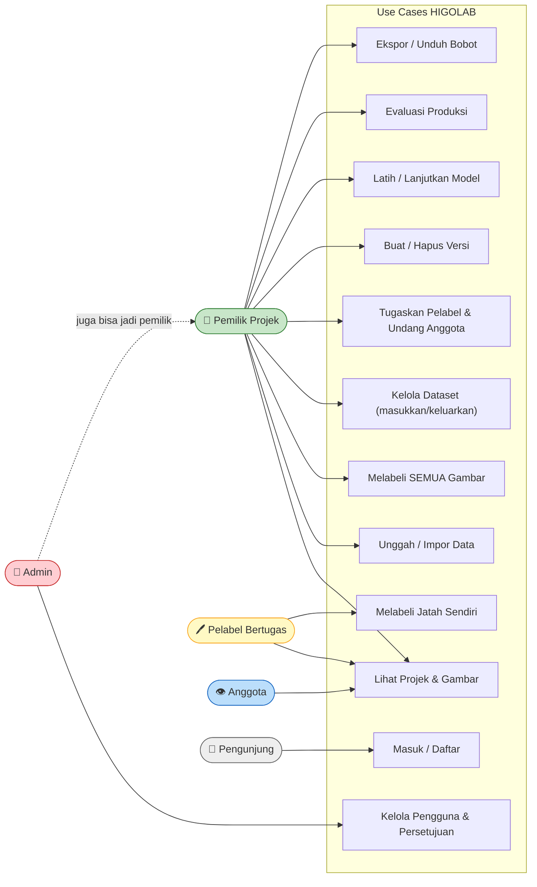

---

## 2. 🔐 Matriks Hak Akses

| Aksi | 🔑 Admin | 👤 Pemilik | 🖊️ Pelabel | 👁️ Anggota | 🚫 Tamu |
|---|:---:|:---:|:---:|:---:|:---:|
| Masuk / Daftar | ✅ | ✅ | ✅ | ✅ | ✅ |
| Kelola pengguna & persetujuan | ✅ | ❌ | ❌ | ❌ | ❌ |
| Lihat projek | ✅¹ | ✅ | ✅ | ✅ | ❌ |
| Melabeli **semua** gambar | ✅¹ | ✅ | ❌ | ❌ | ❌ |
| Melabeli **jatah sendiri** | — | ✅ | ✅ | ❌ | ❌ |
| Kelola dataset | ✅¹ | ✅ | ❌ | ❌ | ❌ |
| Tugaskan pelabel / undang anggota | ✅¹ | ✅ | ❌ | ❌ | ❌ |
| Buat / hapus versi | ✅¹ | ✅ | ❌ | ❌ | ❌ |
| Latih / lanjutkan model | ✅¹ | ✅ | ❌ | ❌ | ❌ |
| Evaluasi & ekspor | ✅¹ | ✅ | ❌ | ❌ | ❌ |

> ¹ Admin punya hak kelola-pengguna sistem; untuk aksi **di dalam sebuah projek** ia mengikuti aturan pemilik (hak penuh hanya pada projek yang ia miliki / folder bersama). Projek yang bukan miliknya & tak diundang **tidak muncul**.

---

## 3. 🗺️ Flowchart Induk (Seluruh Sistem)

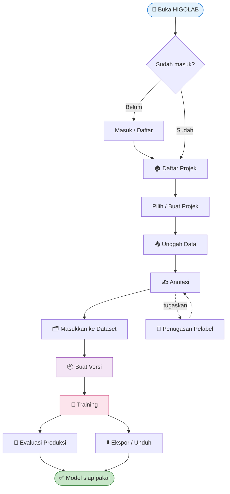

---

## 4. 🔑 Alur: Autentikasi & Pendaftaran

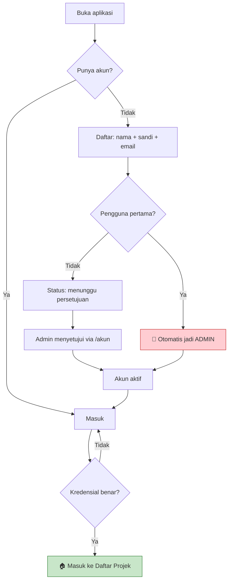

---

## 5. 📤 Alur: Unggah & Impor

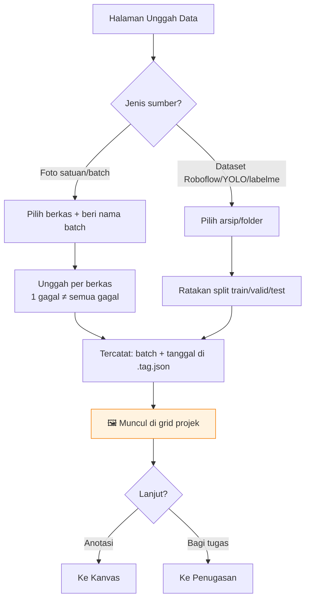

---

## 6. ✍️ Alur: Anotasi (Kanvas + SAM)

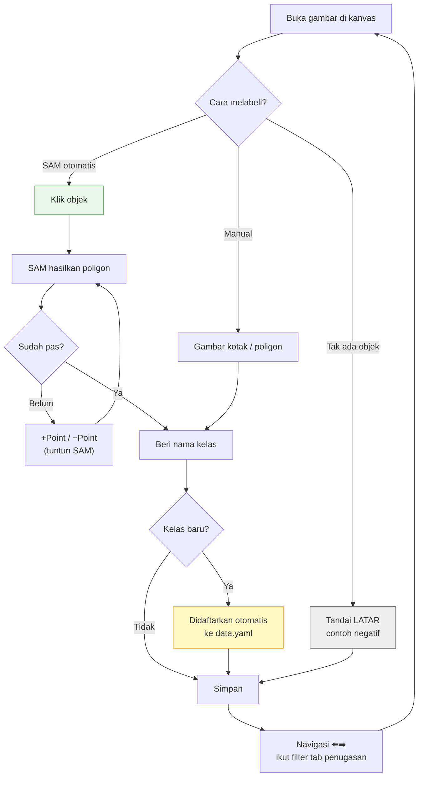

---

## 7. 🗂️ Alur: Dataset & Penugasan

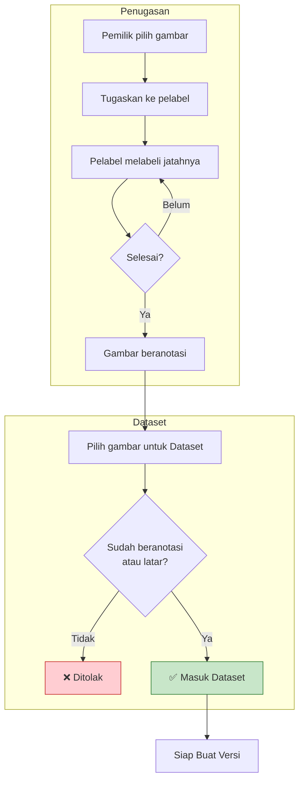

---

## 8. 📦 Alur: Buat Versi (Wizard 6 Langkah)

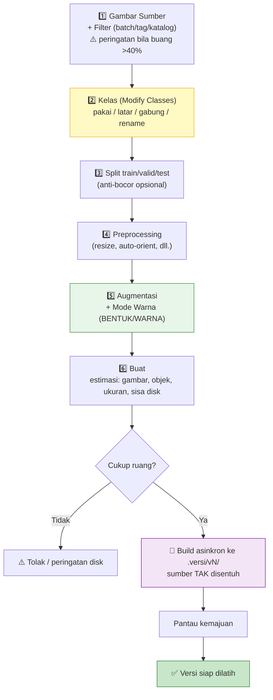

---

## 9. 🎯 Alur: Training & Training Lanjutan

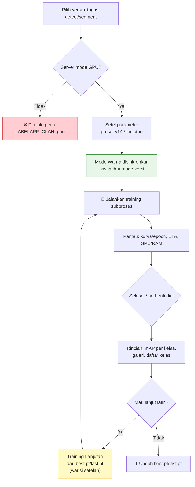

---

## 10. 🔬 Alur: Evaluasi Produksi & Ekspor

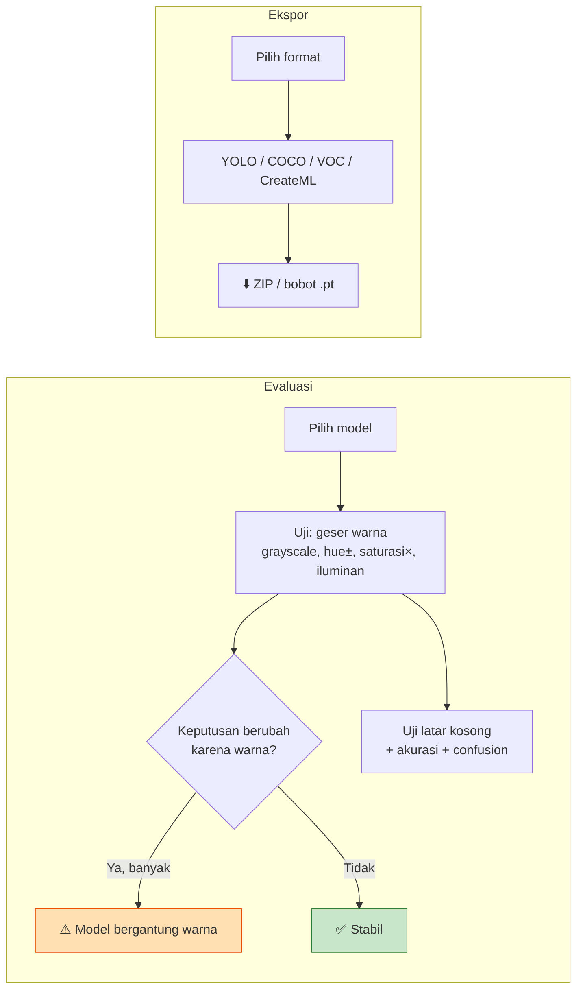

---

## 11. 🔁 Sequence: Buat Versi Asinkron

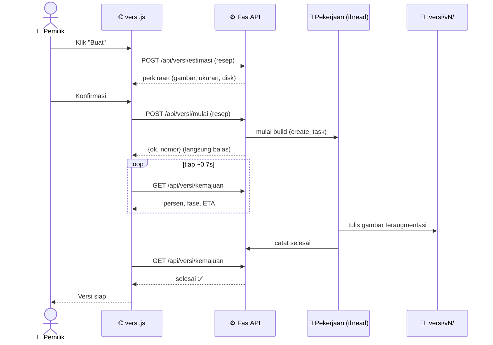

---

## 12. 🔵 State: Status Training

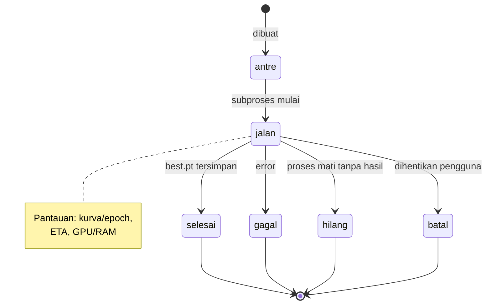

---

## 13. 🎨 State: Tingkat Anotasi Gambar

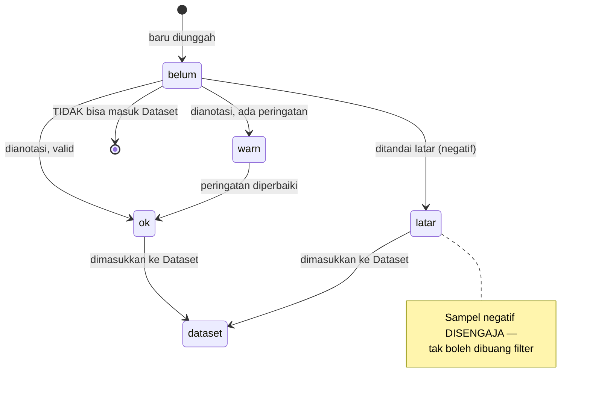

---

## 14. 🗃️ Class Diagram: Model Data (Sidecar)

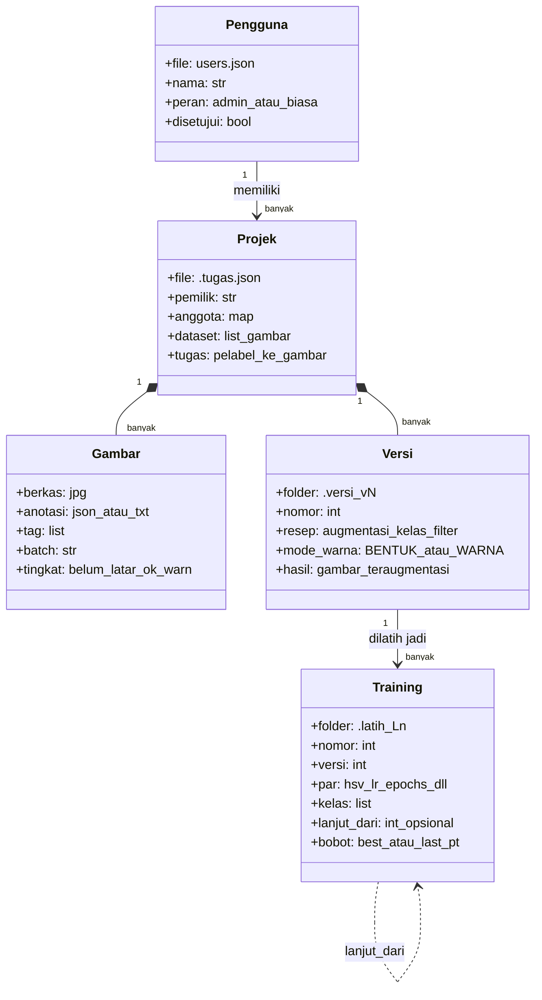

---

⬅️ [Kamus Parameter](04-Kamus-Parameter.md) · [Tentang HIGOLAB](01-Tentang-HIGOLAB.md) 🏠

