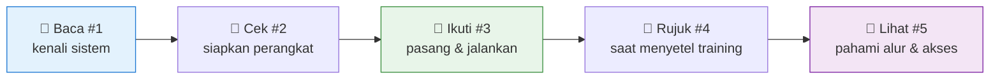

# 📚 Dokumentasi HIGOLAB

*Panduan lengkap: dari mengenal sistem, memasang, sampai memahami tiap parameter & alur.*

---

## 🗂️ Daftar Dokumen

| # | Dokumen | Isi |
|---|---|---|
| 1 | [📖 Tentang HIGOLAB](01-Tentang-HIGOLAB.md) | Apa itu HIGOLAB, fitur-fiturnya, arsitektur, peran pengguna. |
| 2 | [🧰 Kebutuhan Sistem](02-Kebutuhan-Sistem.md) | Perangkat keras, OS, Python, library, variabel lingkungan. |
| 3 | [🚚 Instalasi & Migrasi](03-Instalasi-dan-Migrasi.md) | Pasang & pindah ke PC lain, "database" sidecar, jaringan & firewall. |
| 4 | [📖 Kamus Parameter](04-Kamus-Parameter.md) | Arti hsv, learning rate, epochs, dll. — bahasa sederhana. |
| 5 | [🧩 Diagram UML](05-Diagram-UML.md) | Use-case, hak akses, flowchart tiap fitur, sequence, state, class. |

---

## 🚀 Mulai Cepat

> 💡 Semua diagram di dokumen ini memakai **Mermaid** dan dirender otomatis saat dibuka di **GitHub**.

---

**HIGOLAB** — Alat Pelabelan, Versioning Dataset & Training untuk Mesin Sortir Sampah (RVM)

